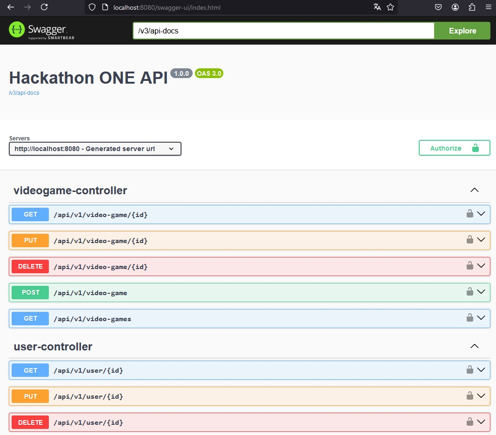
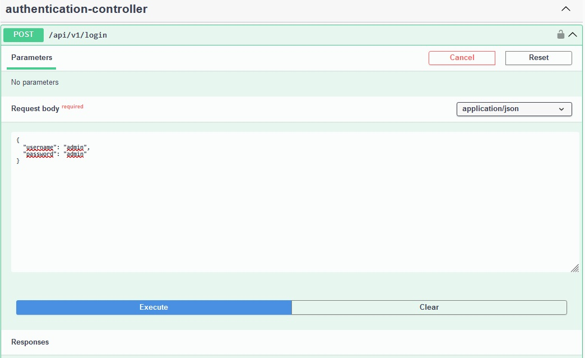
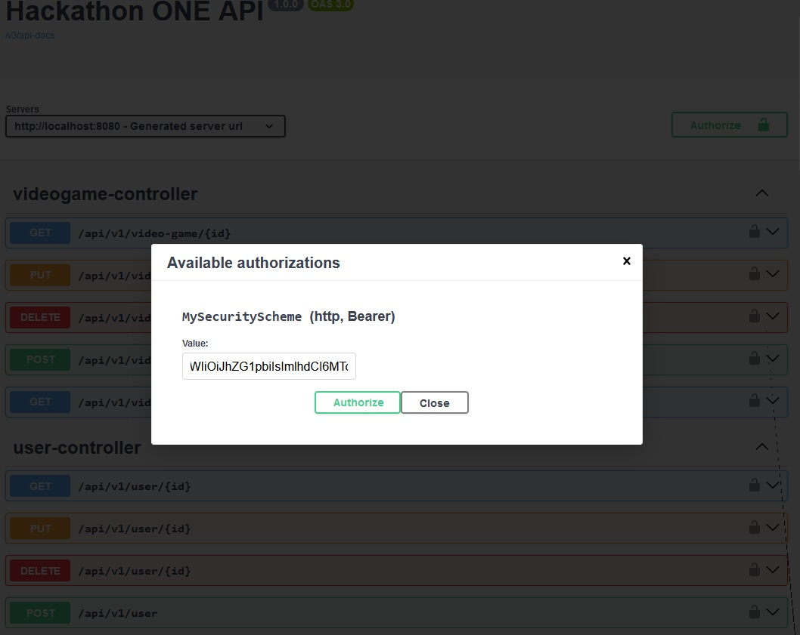
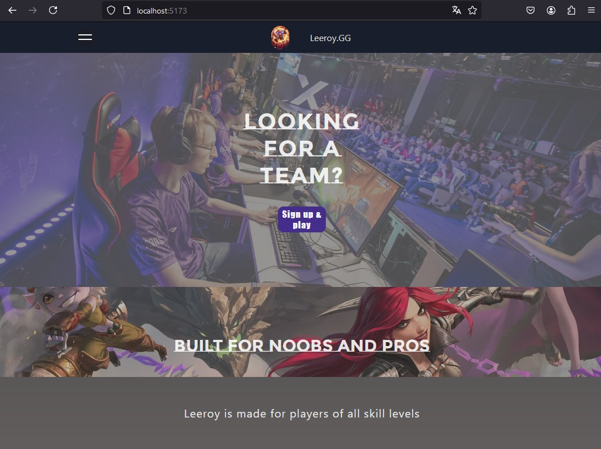

# Hackathon-ONE

Proyecto para el #primerhackathonONE

Descripción del Proyecto: El proyecto desarrollado es una aplicación web que esta dividida en dos partes. El Frontend, realizado en **React**. El Backend, realizado en **Spring Boot** , y la informacion guardada en una base de datos **MySQL**. Permitiendo a los usuarios realizar operaciones CRUD (Crear, Leer, Actualizar, Eliminar).

## [Documentación Backend](https://github.com/Ange1D/Hackathon-ONE/blob/main/documentation/backend-documentation.md)
## [Documentación Frontend](https://github.com/Ange1D/Hackathon-ONE/blob/main/documentation/frontend-documentation.md)

## Instrucciones para ejecutar el proyecto.

### Requisitos
- JDK(Java Development Kit) **17**
- Gradle **7.3** o superior
- MySQL 8.0.30
  - Tener una base de datos llamada "hackathon"
- IntelliJ IDEA o  tu entorno de desarrollo preferido.

### Backend

Abrir la carpeta "api" con IntelliJ IDEA 
Configurar la conexión a MySQL en **api/src/main/resources/application.properties**
Ejecutar el archivo **api\src\main\java\com\hackathon\api\ApiApplication**

Generara automáticamente las tablas necesarias y estará disponible en **http://localhost:8080/swagger-ui.html**



Para obtener token de autorización, en el ultimo endpoint **/api/v1/login** ingresar:
- username: **admin**
- password: **admin**



 Copiar el token generado en la respuesta y dar click en el botón **Authorize** que esta en la parte superior derecha, abrirá un formulario donde se pega el token anteriormente copiado y dar nuevamente click en el botón **Authorize**, de esta manera se tendrá acceso a todos los endpoints desde swagger.
 
 


### Frontend 

Dentro de la carpeta "frontent" utilizar los siguientes comandos

```sh
npm install
```

Después
```sh
npm run dev
```

La aplicación estará disponible en **http://localhost:5173/**



## Asignación de Actividades:

Se dividieron las actividades de la siguiente manera

### Equipo Frontend:

Actividad                                                                     | Responsable
------------------------------------------------------------------------------| ---------------------------------------
Diseño de la interfaz de usuario y maquetación.                               | [Diana](https://github.com/Natsumychan)
Implementación de la lógica de manejo de estado y validación de formularios.  | [David](https://github.com/Rosnye)
Integración con la API backend y manejo de peticiones HTTP.                   | [David](https://github.com/Rosnye)


### Equipo Backend:

Actividad                                                   | Responsable
------------------------------------------------------------| ---------------------------------------
Implementación de los modelos y la base de datos.           | [Angel](https://github.com/Ange1D)
Desarrollo de los controladores y lógica de negocio.        | [Nikolai](https://github.com/Nikolaifan24), [Maynor](https://github.com/Maynor06) y [Angel](https://github.com/Ange1D)
Implementación de las rutas y la autenticación de usuarios. | [Maynor](https://github.com/Maynor06)

Adicionalmente se utilizo un [tablero kanban](https://github.com/users/Ange1D/projects/2) para coordinar las actividades 