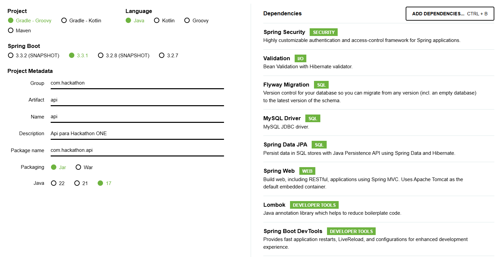
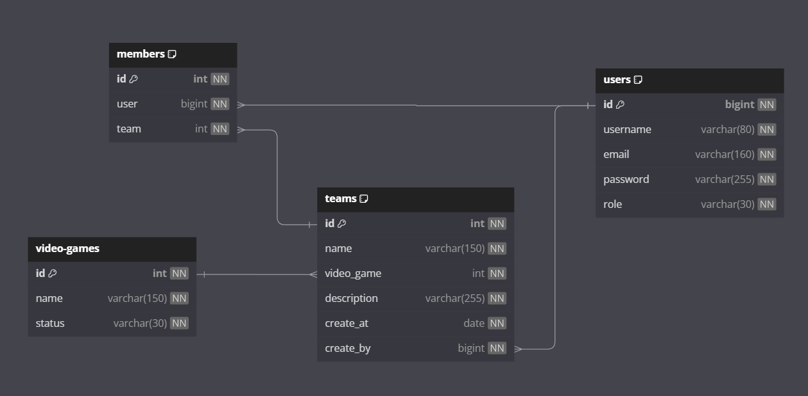

# Documentación Backend

1. [Creación del proyecto](#1-creación-del-proyecto)  
2. [Creación de la base de datos](#1-creación-de-la-base-de-datos)  
3. [Tablas de la base de datos](#3-tablas-de-la-base-de-datos)  

## 1. Creación del proyecto

El proyecto fue creado en [Spring Initializr](https://start.spring.io/) con las siguientes especificaciones:



- Gestor de Dependencias: **Gradle - Groovy**
- Versión de Spring Boot: **3.3.1**
- Lenguaje: **Java**
- Empaquetado: **jar**
- Versión de Java: **17**
- Dependencias:

  - **Spring Security**: Utilizada para agregar seguridad a la aplicación. Proporciona las bibliotecas y configuraciones necesarias para implementar autenticación y autorización.
  - **Validation**: Utilizada para realizar validaciones en los datos de entrada de la aplicación.
  - **Flyway Migration**: Utilizada para realizar migraciones de base de datos de manera controlada y automatizada.Es de gran ayuda para administrar y aplicar cambios en la estructura de la base de datos.
  - **MySQL  Driver**: Utilizada para conectarse a una base de datos MySQL desde una aplicación Java. Proporciona las bibliotecas y controladores necesarios para establecer la conexión y ejecutar consultas en la base de datos.
  - **Spring Data JPA**: Utilizada para trabajar con JPA (Java Persistence API) en aplicaciones Spring Boot. Proporciona las bibliotecas y configuraciones necesarias para interactuar con una base de datos utilizando JPA.
  - **Spring Web**: Utilizada para desarrollar aplicaciones web utilizando Spring Boot. Proporciona las bibliotecas y configuraciones necesarias para crear controladores web y manejar solicitudes HTTP.
  - **Lombok**: Utilizada para reducir la cantidad de código en las clases Java. Proporciona anotaciones que generan automáticamente métodos, constructores y otros elementos comunes en las clases.
  - **Spring Boot Dev Tools**: Utilizada para facilitar el desarrollo y la depuración de aplicaciones Spring Boot.

- Adicionalmente se agregaron:

  - **SpringDoc OpenAPI**: Utilizada para documentar y exponer una API REST basada en Spring Boot utilizando OpenAPI y Swagger UI. Proporciona una interfaz de usuario para explorar y probar la API.
  - **JJWT**: Utilizada para trabajar con JWT(JSON Web Tokens). Proporciona las bibliotecas y herramientas necesarias para generar, firmar y verificar tokens JWT.

## 2. Creación de la base de datos

La base de datos fue creada en el sistema gestor de bases de datos relacional [MySQL](https://www.mysql.com/) con el siguiente comando: 
```sh
CREATE DATABASE hackathon;
```
## 3. Tablas de la base de datos

Al ejecutar el proyecto **Flyway Migration** generara las siguientes tablas:



- **users**: Almacena información sobre los usuarios del sistema. Contiene los siguientes campos:
  - *id*: Identificador único del usuario, con autoincremento.
  - *username*: Nombre de usuario, de hasta 80 caracteres, que no puede ser nulo y debe ser único.
  - *email*: Dirección de correo electrónico del usuario, de hasta 160 caracteres, que no puede ser nulo y debe ser único.
  - *password*: Contraseña del usuario, de hasta 255 caracteres, que no puede ser nula.
  - *role*: Rol del usuario en el sistema, de hasta 30 caracteres, que no puede ser nulo.

- **video-games**: Guarda información sobre los videojuegos. Sus campos son:
  - *id*: Identificador único del videojuego, con autoincremento.
  - *name*: Nombre del videojuego, de hasta 150 caracteres, que no puede ser nulo.
  - *status*: Estado del videojuego, de hasta 30 caracteres, que no puede ser nulo.

- **teams**: Almacena datos sobre los equipos. Sus campos son:
  - *id*: Identificador único del equipo, con autoincremento.
  - *name*: Nombre del equipo, de hasta 150 caracteres, que no puede ser nulo.
  - *video_game*: Referencia al videojuego al que pertenece el equipo. Vinculado a la tabla "video-games"
  - *description*: Descripción del equipo, de hasta 255 caracteres, que no puede ser nula.
  - *create_at*: Fecha de creación del equipo, que no puede ser nula.
  - *create_by*: Referencia al usuario que creó el equipo, que no puede ser nula. Vinculado a la tabla "users"

 - **members**: Guarda la información de los miembros de los equipos. Sus campos son:
   - *id*: Identificador único, con autoincremento.
   - *user*: Referencia al usuario que es miembro del equipo. Vinculado a la tabla "users"
   - *team*: Referencia al equipo al que pertenece el miembro. Vinculado a la tabla "teams"