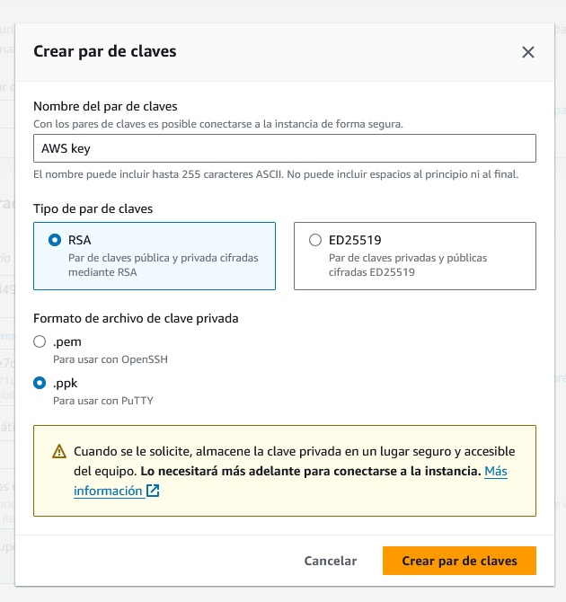

# Documentación Backend

1. [Requisitos del proyecto](#1-requisitos-del-proyecto)  
2. [Creación del proyecto](#2-creación-del-proyecto)  
3. [Estructura del proyecto](#3-estructura-del-proyecto)  
4. [Creación de la base de datos](#4-creación-de-la-base-de-datos)  
5. [Tablas de la base de datos](#5-estructura-de-la-base-de-datos)  
6. [Endpoints del proyecto](#6-endpoints-del-proyecto)   
7. [Construcción del proyecto](#7-construcción-del-proyecto)
8. [Deploy del proyecto](#8-deploy-del-proyecto)  

## 1. Requisitos del proyecto
- [JDK(Java Development Kit) **17**](https://adoptium.net/es/temurin/releases/?package=jdk&version=17).
- [Gradle **7.3** o superior](https://gradle.org/).
- [IntelliJ IDEA](https://www.jetbrains.com/es-es/idea/) o tu entorno de desarrollo preferido.
- [MySQL 8.0.30](https://dev.mysql.com/downloads/)

## 2. Creación del proyecto

El proyecto fue creado en [Spring Initializr](https://start.spring.io/) con las siguientes especificaciones:


- Gestor de Dependencias: **Gradle - Groovy**
- Versión de Spring Boot: **3.3.1**
- Lenguaje: **Java**
- Empaquetado: **jar**
- Versión de Java: **17**
- Dependencias:

  - **Spring Security**: Utilizada para agregar seguridad a la aplicación. Proporciona las bibliotecas y configuraciones necesarias para implementar autenticación y autorización.
  - **Validation**: Utilizada para realizar validaciones en los datos de entrada de la aplicación.
  - **Flyway Migration**: Utilizada para realizar migraciones de base de datos de manera controlada y automatizada. Es de gran ayuda para administrar y aplicar cambios en la estructura de la base de datos.
  - **MySQL  Driver**: Utilizada para conectarse a una base de datos MySQL desde una aplicación Java. Proporciona las bibliotecas y controladores necesarios para establecer la conexión y ejecutar consultas en la base de datos.
  - **Spring Data JPA**: Utilizada para trabajar con JPA (Java Persistence API) en aplicaciones Spring Boot. Proporciona las bibliotecas y configuraciones necesarias para interactuar con una base de datos utilizando JPA.
  - **Spring Web**: Utilizada para desarrollar aplicaciones web utilizando Spring Boot. Proporciona las bibliotecas y configuraciones necesarias para crear controladores web y manejar solicitudes HTTP.
  - **Lombok**: Utilizada para reducir la cantidad de código en las clases Java. Proporciona anotaciones que generan automáticamente métodos, constructores y otros elementos comunes en las clases.
  - **Spring Boot Dev Tools**: Utilizada para facilitar el desarrollo y la depuración de aplicaciones Spring Boot.

- Adicionalmente se agregaron:

  - **SpringDoc OpenAPI**: Utilizada para documentar y exponer una API REST basada en Spring Boot utilizando OpenAPI y Swagger UI. Proporciona una interfaz de usuario para explorar y probar la API.
  - **JJWT**: Utilizada para trabajar con JWT(JSON Web Tokens). Proporciona las bibliotecas y herramientas necesarias para generar, firmar y verificar tokens JWT.

## 3. Estructura del proyecto

- **api\Controllers**: Esta carpeta contiene los controladores de la API. Los controladores son responsables de manejar las solicitudes HTTP y generar las respuestas correspondientes. Cada controlador se encarga de un conjunto específico de rutas y acciones.
- **api\model**: Esta carpeta contiene los modelos de datos de la API. Los modelos representan las entidades y estructuras de datos utilizadas en la aplicación.
- **api\model\dao**: Esta carpeta contiene los objetos de acceso a datos (DAO, por sus siglas en inglés). Los DAO son responsables de interactuar con la base de datos y realizar operaciones de lectura y escritura. Estos objetos encapsulan la lógica de acceso a datos y proporcionan métodos para realizar consultas y actualizaciones en la base de datos.
- **api\model\dto**: Esta carpeta contiene los objetos de transferencia de datos (DTO, por sus siglas en inglés). Los DTO son objetos utilizados para transferir datos entre diferentes capas de la aplicación o entre la aplicación y los clientes. 
- **api\model\entity**: Esta carpeta contiene las clases que representan las entidades de negocio de la aplicación. Estas clases tienen propiedades y métodos que definen el comportamiento y las características de las entidades.
- **api\model\payload**: Esta carpeta contiene los objetos que representan los mensajes enviados en las solicitudes HTTP.
- **api\Security**: Esta carpeta contiene los componentes relacionados con la seguridad de la API. Clases para autenticación, autorización y gestión de roles y permisos.
- **api\Security\Filters**: Esta carpeta contiene los filtros de seguridad de la API. Los filtros de seguridad se utilizan para aplicar lógica de seguridad a las solicitudes y respuestas de la API. Pueden realizar tareas como la validación de tokens de autenticación y la verificación de permisos
- **api\Security\jwt**: Esta carpeta contiene los componentes relacionados con la implementación de JSON Web Tokens (JWT) para la autenticación y autorización en la API. Los JWT son tokens de seguridad que se utilizan para verificar la identidad de los usuarios y controlar el acceso a los recursos protegidos.
- **api\Service**: Esta carpeta contiene los servicios de la API. Los servicios son componentes que encapsulan la lógica de negocio de la aplicación y se utilizan para realizar operaciones complejas o coordinar la interacción entre diferentes componentes.
- **api\Service\impl**: Esta carpeta contiene las implementaciones concretas de los servicios de la API. Estas implementaciones pueden incluir la lógica específica de la aplicación y utilizar los objetos de acceso a datos y otros componentes para realizar las operaciones necesarias.

- **resources\db\migration**: Esta carpeta contiene los scripts de migración de la base de datos. Estos scripts son utilizados por Flyway para actualizar la estructura de la base de datos de una versión a otra.

## 4. Creación de la base de datos

La base de datos fue creada en el sistema gestor de bases de datos relacional [MySQL](https://www.mysql.com/) con el siguiente comando: 
```sh
CREATE DATABASE hackathon;
```
## 5. Estructura de la base de datos

Al ejecutar el proyecto **Flyway Migration** generara las siguientes tablas:


- **users**: Almacena información sobre los usuarios del sistema. Contiene los siguientes campos:
  - *id*: Identificador único del usuario, con autoincremento.
  - *username*: Nombre de usuario, de hasta 80 caracteres, que no puede ser nulo y debe ser único.
  - *email*: Dirección de correo electrónico del usuario, de hasta 160 caracteres, que no puede ser nulo y debe ser único.
  - *password*: Contraseña del usuario, de hasta 255 caracteres, que no puede ser nula.
  - *role*: Rol del usuario en el sistema, de hasta 30 caracteres, que no puede ser nulo.

- **video-games**: Guarda información sobre los videojuegos. Sus campos son:
  - *id*: Identificador único del videojuego, con autoincremento.
  - *name*: Nombre del videojuego, de hasta 150 caracteres, que no puede ser nulo.
  - *status*: Estado del videojuego, de hasta 30 caracteres, que no puede ser nulo.

- **teams**: Almacena datos sobre los equipos. Sus campos son:
  - *id*: Identificador único del equipo, con autoincremento.
  - *name*: Nombre del equipo, de hasta 150 caracteres, que no puede ser nulo.
  - *video_game*: Referencia al videojuego al que pertenece el equipo. Vinculado a la tabla "video-games"
  - *description*: Descripción del equipo, de hasta 255 caracteres, que no puede ser nula.
  - *create_at*: Fecha de creación del equipo, que no puede ser nula.
  - *create_by*: Referencia al usuario que creó el equipo, que no puede ser nula. Vinculado a la tabla "users"

 - **members**: Guarda la información de los miembros de los equipos. Sus campos son:
   - *id*: Identificador único, con autoincremento.
   - *user*: Referencia al usuario que es miembro del equipo. Vinculado a la tabla "users"
   - *team*: Referencia al equipo al que pertenece el miembro. Vinculado a la tabla "teams"

## 6. Endpoints del proyecto 

La URL base del API es **/api/v1**

|    URL/ACCIÓN   |      GET      |      PUT      |     PATCH     |      POST     |     DELETE    |
|-----------------|---------------|---------------|---------------|---------------|---------------|
| /login          |      N/A      |      N/A      |      N/A      | Crear Token   |      N/A      |
| /user           |      N/A      |      N/A      |      N/A      |      Crear    |      N/A      |
| /user/:id       |      Obtener  |  Reemplazar   |      N/A      |      N/A      |    Eliminar   |
| /video-games    |      Listar   |      N/A      |      N/A      |      N/A      |      N/A      |
| /video-game     |      N/A      |      N/A      |      N/A      |      Crear    |      N/A      |
| /video-game/:id |      Obtener  |  Reemplazar   |      N/A      |      N/A      |    Eliminar   |
| /teams          |      Listar   |      N/A      |      N/A      |      N/A      |      N/A      |
| /team           |      N/A      |      N/A      |      N/A      |      Crear    |      N/A      |
| /team/:id       |      Obtener  |  Reemplazar   |      N/A      |      N/A      |    Eliminar   |
| /members        |      Listar   |      N/A      |      N/A      |      N/A      |      N/A      |
| /member         |      N/A      |      N/A      |      N/A      |      Crear    |      N/A      |
| /member/:id     |      Obtener  |  Reemplazar   |      N/A      |      N/A      |    Eliminar   |

## 7. Construcción del proyecto  

Para construir el proyecto se uso [IntelliJ IDEA](https://www.jetbrains.com/es-es/idea/) en las opciones de la derecha en "Gradle". Seleccionando Tasks->build->build


Y en la carpeta "build"  se generará el .jar del proyecto.


## 8. Deploy del proyecto 

Para hacer el deploy de la aplicación utilizamos [Amazon Web Services](https://aws.amazon.com/es/)

- Creamos un grupo de seguridad

En el **panel EC2** vamos a "Red y seguridad" y seleccionamos "*Security Groups*"


Después damos click en el botón "Crear grupo de seguridad"


Creamos el grupo de seguridad con la siguiente configuración


En reglas de entrada seleccionamos MySQL/Aurora y tipo de origen y destino seleccionamos Anywhere-IPV4


- Creamos la base de datos

En el **panel RDS** vamos a "Bases de datos"


Después damos click en el botón "Crear base de datos"


Creamos la base de datos con la siguiente configuración


Motor: MySQL
Version: 8.0.35
Plantillas: Capa gratuita
Acceso publico: si
Grupo de seguridad: MySQL-hackathon(el que creamos al inicio)

Al terminar de crearse nos dará el host y puerto
Lo copiamos en el application.properties del proyecto, así como el usuario y contraseña.
Tambien nos conectamos mediante [MySQL Workbench](https://www.mysql.com/products/workbench/) o el programa de tu preferencia. para crear la base de datos "hackathon".


- Creamos la instancia

En el **panel EC2** vamos a "Instancias"


Después damos click en el botón "Lanzar instancias"


Creamos la instancia con la siguiente configuración


Imagen: Ubuntu

Creamos par de claves en formato .ppk



Continuamos con la configuración de la instancia


Una vez creada la instancia copiamos la "Dirección IPV4 publica"


- Conexión a la instancia

Mediante [Putty](https://putty.org/) nos conectaremos a la instancia.

Vamos a *Conections*->*SSH*->*Auth*->*Credentials* y agregamos la llave .ppk que generamos anteriormente


En *Session* escribimos "ubuntu@" + la dirección IPV4 publica que copiamos de la instancia, el puerto 22 y tipo *SSH*


Una vez conectado ejecutaremos los siguientes comandos

```sh
sudo apt update
```

Para instalar el jdk

```sh
sudo apt install openjdk-17-jdk
```

Ahora subiremos el [proyecto construido](#7-construción-del-proyecto) anteriormente mediante [FileZilla](https://filezilla-project.org/)

En FileZilla seleccionamos protocolo *SFTP*, en servidor la IPV4 publica, en modo de acceso *archivo de claves* seleccionamos la llave .ppk y usuario "ubuntu"


Una vez conectado dentro la carpeta "Ubuntu" crearemos una carpeta para el proyecto en este caso creamos la carpeta "app" y copiamos el proyecto construido


Regresamos a Putty y ejecutaremos los siguientes comandos

Para instalar nginx

```sh
sudo apt install nginx
```

Archivo de configuración de Nginx

```sh
sudo nano /etc/nginx/sites-available/app
```

Este archivo de configuración define un servidor virtual que escucha en el puerto 80 y está asociado a una dirección IP pública específica. Este servidor virtual se utiliza para redirigir las solicitudes a la aplicación que se ejecuta en http://127.0.0.1:8080.

```sh
server {
    listen 80;
    server_name IPV4publica;

    location / {
        proxy_pass http://127.0.0.1:8080; 
        proxy_set_header Host $host;
        proxy_set_header X-Real-IP $remote_addr;
        proxy_set_header X-Forwarded-For $proxy_add_x_forwarded_for;
        proxy_set_header X-Forwarded-Proto $scheme;
    }
}

```


Este comando crea un enlace simbólico entre el archivo de configuración de Nginx

```sh
sudo ln -s /etc/nginx/sites-available/app /etc/nginx/sites-enabled/
```

Archivo de configuración del servicio de systemd

```sh
sudo nano /etc/systemd/system/app.service
```

Define cómo se debe iniciar y ejecutar el servicio de la aplicación.

```sh
[Unit]
Description=Hackathon App
After=network.target

[Service]
ExecStart=/usr/bin/java -jar /home/ubuntu/app/nombreProyecto.jar
WorkingDirectory=/home/ubuntu/app
User=ubuntu
Restart=no

[Install]
WantedBy=multi-user.target
```

Este comando habilita el servicio de la aplicación para que se inicie automáticamente al arrancar el sistema.

```sh
sudo systemctl enable app.service
```

Este comando inicia el servicio de la aplicación.

```sh
sudo systemctl start app.service
```

El proyecto debe estar funcionando. Para comprobar puedes ir a IPV4Publica/swagger-ui.html


