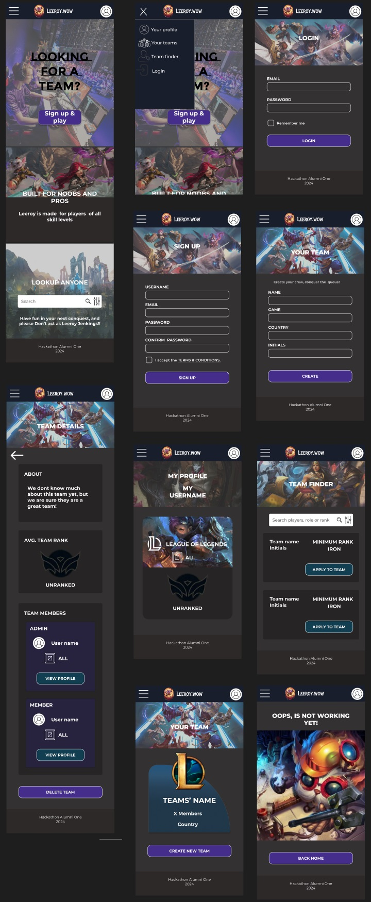
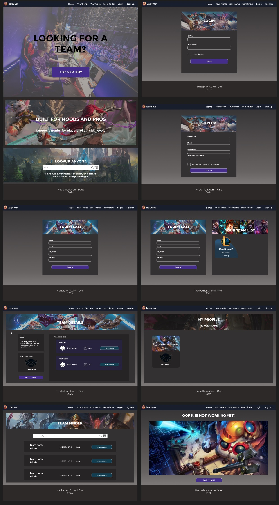

# Documentación Frontend

1. [Maquetación del proyecto](#1-maquetación-del-proyecto)  
2. [Creación del proyecto](#2-creación-del-proyecto)  

## 1. Maquetación del proyecto

La maquetación del proyecto fue creada usando [Figma](https://www.figma.com).





## 2. Creación del proyecto

El proyecto fue creado usando [Vite](https://vitejs.dev/) con el siguiente comando:

```sh
npm create vite@latest frontend -- --template react
```

3. **Dependencias del proyecto:**
    - `axios`
    - `react` y `react-dom`
    - `react-router-dom`

4. **Dependencias de desarrollo:**
    - `@types/react` y `@types/react-dom`
    - `@vitejs/plugin-react`
    - `eslint`, `eslint-plugin-react`, `eslint-plugin-react-hooks` y `eslint-plugin-react-refresh`
    - `vite`


5. **`frontend/public/images`:** Esta carpeta almacena las imágenes de fondo y otros recursos visuales utilizados en la aplicación.

6. **`frontend/src/components`:** Aquí se encuentran los componentes principales de tu aplicación. Cada carpeta contiene un archivo `index.jsx` (que define el componente) y su respectivo archivo CSS.

    - `footer`
    - `home`
    - `login`
    - `myProfile`
    - `nav`
    - `newTeam`
    - `notFound`
    - `register`
    - `teamCreated`
    - `teamDetails`
    - `teamFinder`

### Script de autenticacion `{frontend\src\services\authService.js}`

7. **`register(username, password)`**:
   - Esta función realiza una solicitud HTTP POST al endpoint `${API_URL}/user` para registrar un nuevo usuario.
   - Toma dos parámetros: `username` (nombre de usuario) y `password` (contraseña).
   - Devuelve una promesa que se resuelve con la respuesta del servidor.

8. **`login(username, password)`**:
   - Realiza una solicitud HTTP POST al endpoint `${API_URL}/login` para iniciar sesión.
   - También toma dos parámetros: `username` y `password`.
   - Después de recibir la respuesta del servidor, verifica si contiene un token de acceso.
   - Si hay un token, lo almacena en el almacenamiento local (`localStorage`) y devuelve los datos de la respuesta.

9. **`logout()`**:
   - Elimina el token de acceso almacenado en el almacenamiento local, lo que equivale a cerrar la sesión del usuario.

10. **`getCurrentUser()`**:
   - Obtiene el token de acceso del almacenamiento local.
   - Si no hay un token, devuelve `null`.
   - Si hay un token, intenta decodificarlo para obtener información sobre el usuario (como el nombre de usuario y la contraseña).
   - Si la decodificación tiene éxito, devuelve un objeto con el token, el nombre de usuario y la contraseña. De lo contrario, también devuelve `null`.

11. **`getAuthHeader()`**:
   - Devuelve un objeto que contiene el encabezado de autorización (`Authorization`) con el token de acceso.
   - Si no hay un token, devuelve un objeto vacío.

